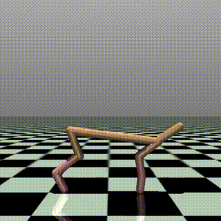

# 🐆 Multi-Gait Controller — Three Locomotion Personalities, One Brain

> One neural network. Three ways to move. Switched on command.



---

## The Idea

Imagine teaching a dog three commands:

| Command | Behavior |
|---------|----------|
| 🟣 "Easy" | Walk slowly and carefully |
| 🟡 "Go!" | Run as fast as possible |
| 🟢 "Conserve" | Move efficiently, save energy |

This project does exactly that — with a robot instead of a dog, and numbers instead of voice commands. **One neural network learns all three behaviors simultaneously.**

---

## The Three Gaits

| | Mode | Name | What it does | Reward design |
|-|------|------|--------------|---------------|
| 🟣 | `0` | **Prowl** | Slow, controlled, stable | Target speed ~1.0 m/s · heavy smoothness bonus |
| 🟡 | `1` | **Sprint** | Maximum forward velocity | 4× speed reward · minimal energy penalty |
| 🟢 | `2` | **Trot** | Efficient, sustainable pace | Forward motion · heavy energy cost penalty |

---

## How the Robot Knows Which Mode It's In

Every frame, the robot gets a list of numbers about its body:

```
Standard obs = [joint_positions, joint_velocities, body_orientation, ...]
```

We add **3 extra numbers** at the end — a mode signal:

```
Prowl mode  →  [...body info...,  1, 0, 0]
Sprint mode →  [...body info...,  0, 1, 0]
Trot mode   →  [...body info...,  0, 0, 1]
```

The robot learns: *"when I see `[0,1,0]` — go fast. When I see `[1,0,0]` — be smooth."*

---

## How the Points Change Per Mode

```python
if mode == 0:   # PROWL — calm and controlled
    reward = 1.0 * forward_vel          # gentle forward motion
           - 1.5 * abs(x_vel - 1.0)    # stay near 1.0 m/s
           + 3.0 * ctrl_cost            # smooth movements rewarded

elif mode == 1:  # SPRINT — maximum speed
    reward = 4.0 * forward_vel          # push velocity to max
           + 0.5 * ctrl_cost            # light energy penalty

elif mode == 2:  # TROT — energy efficient
    reward = 2.0 * forward_vel          # move forward
           + 5.0 * ctrl_cost            # heavy energy penalty
```

---

## What Happens During Training

```
Step 1  → Robot spawns, gets randomly assigned a mode
Step 2  → Robot tries to move, gets reward based on that mode
Step 3  → Episode ends (robot falls or time runs out)
Step 4  → Brain updates slightly based on what worked
Step 5  → Repeat 3,000,000 times
```

After **3 million attempts in ~8 minutes**, the robot has learned all three personalities.

---

## Results

| Metric | Value |
|--------|-------|
| Training steps | 3,000,000 |
| Training time | ~8 min (Apple M-series) |
| Parallel environments | 4 |
| Steps per second | ~6,000 |
| Distinct gaits learned | 3 |

---

## Why This Matters in Real Robotics

Real robots like **Tesla Optimus** need to move differently based on context:

| Situation | Best gait |
|-----------|-----------|
| 🏭 Near humans on a factory floor | 🟣 Prowl — slow and safe |
| 🏃 Moving across open warehouse space | 🟡 Sprint — cover ground fast |
| 🔋 Long 8-hour work shift | 🟢 Trot — conserve battery |

A robot that can only do one of these isn't useful in the real world. Context-aware locomotion is a core challenge in humanoid robotics — this project is a direct step toward it.

---

## The Robot — HalfCheetah

```
        ___
       /   \     ← body
      /     \
  ===|       |===   ← 2 hip joints
     |       |
    /|       |\
   / |       | \
  /  |_______|  \
 ↑               ↑
knee joints    knee joints
     ↓               ↓
   feet           feet
```

- 6 actuated joints (2 hips, 2 knees, 2 feet)
- 2D physics (can't fall sideways)
- Lives in MuJoCo simulation

---

## Architecture

```
┌──────────────────────────────────────┐
│          Observation (20-dim)        │
│  joint_pos + vel + body_state        │
│  + [1, 0, 0] / [0, 1, 0] / [0, 0, 1]│  ← gait mode
└────────────────┬─────────────────────┘
                 │
        ┌────────▼────────┐
        │   PPO Policy    │
        │  MLP [256,256]  │
        │  learns all 3   │
        │  modes at once  │
        └────────┬────────┘
                 │
        ┌────────▼────────┐
        │  6 joint torques│
        │  (different per │
        │   active mode)  │
        └─────────────────┘
```

---

## Run It Yourself

```bash
# 1. Setup
conda create -n rl_humanoid python=3.10
conda activate rl_humanoid
pip install gymnasium mujoco stable-baselines3 tensorboard imageio

# 2. Train (~8 minutes)
python train_multigait.py

# 3. Watch training live
tensorboard --logdir ./logs/
# → open http://localhost:6006
# → you'll see 3 separate reward curves, one per gait

# 4. Record demo video
python demo_multigait.py
```

---

## Files

```
📁 multi-gait-controller/
├── multi_gait_env.py      ← Custom environment (reward switching logic)
├── train_multigait.py     ← Training script
├── demo_multigait.py      ← Records demo video of all 3 gaits
├── results/
│   └── demo.gif           ← All 3 gaits back to back
└── videos/
    └── multigait_demo.mp4 ← Full quality video
```

---

## Roadmap

- [x] Custom MultiGait environment wrapper
- [x] 3-mode reward function switching
- [x] Single PPO policy learning all 3 gaits simultaneously
- [x] Per-mode TensorBoard evaluation curves
- [ ] Real-time keyboard mode switching mid-episode
- [ ] Domain randomisation — random floor friction + robot mass
- [ ] Port to NVIDIA Isaac Lab for GPU-parallel training
- [ ] Extend to Humanoid-v5 — 3 humanoid gaits
- [ ] PPO vs SAC comparison — which learns gaits better?

---

## Stack

`Python 3.10` · `MuJoCo 3.x` · `Gymnasium` · `Stable-Baselines3 (PPO)` · `TensorBoard`

---

*Built on a MacBook — no GPU required.*
*Part of an ongoing robotics portfolio targeting humanoid locomotion research.*
